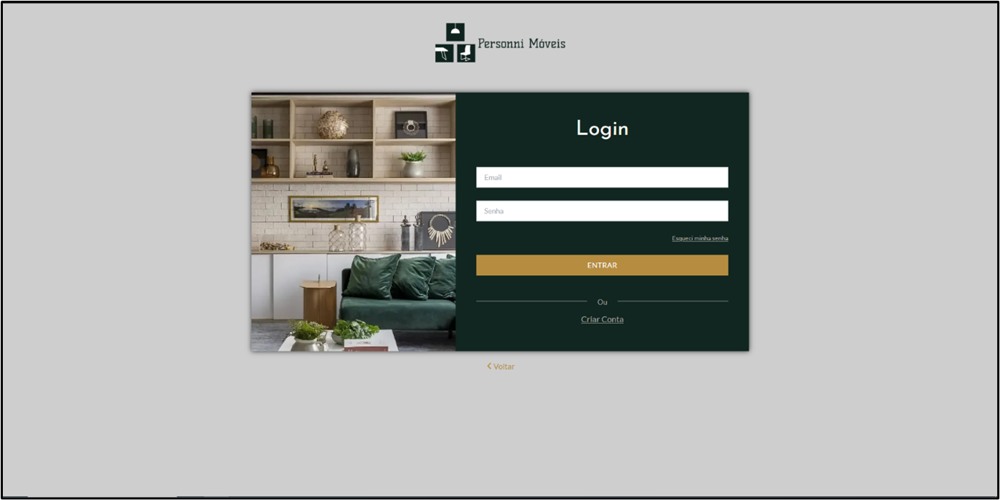
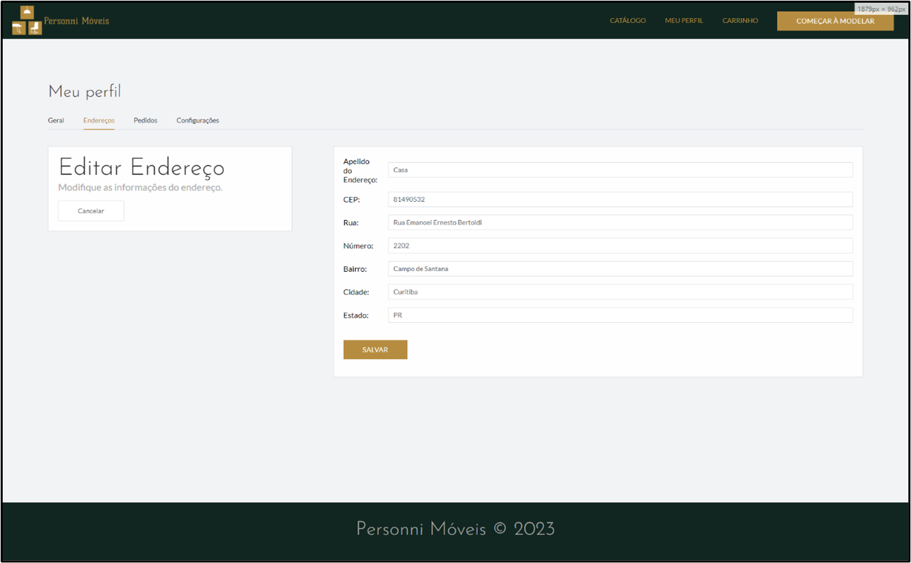
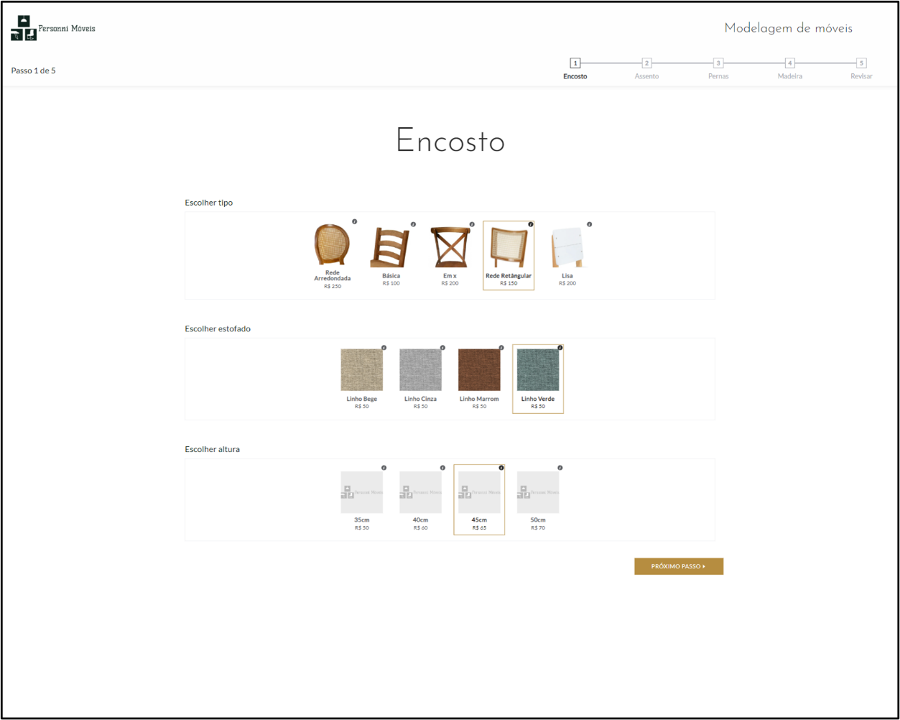
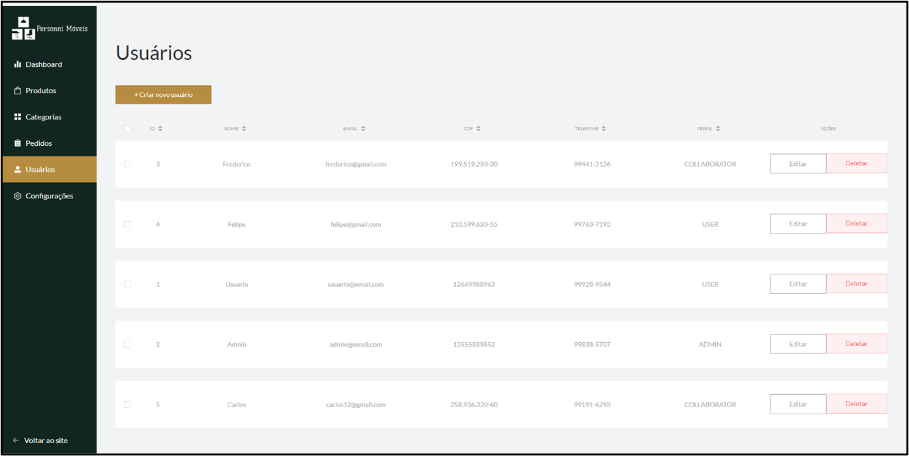
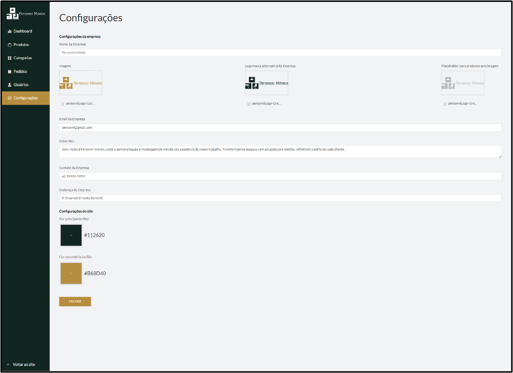

# PersonniMoveis - E-Commerce focused on customizable furniture
Final assignment of Software Engineering course: Development of a E-Commerce Web Application using Vue.js and Spring Boot

## Authors
- Aguinaldo Lucas Machado - [Aguinalds](https://github.com/Aguinalds)
- Arthur Ogibowski Pereira - [arthur-ogibowski](https://github.com/arthur-ogibowski)
- Athos Mantovani Feres Rodrigues - [Athosmfr](https://github.com/Athosmfr)
- Gabriel Ferraro Severino - [gabriel-ferraro](https://github.com/gabriel-ferraro)

## Thesis Abstract

The project's goal is to develop an online sales platform that provides a new form of business to small and medium-sized 
businesses in the furniture industry who lack technology advantages. With the Modeling Furniture in Steps tool, the platform 
offers an interactive user experience and makes it easier for customers engagement. By choosing from alternatives offered by 
the company and following a step-by-step process, customers can customize their own furniture. With no need for direct 
communication with the retailer cause purchase transactions take place directly on the platform. Standard furniture pieces 
provided by the store can also be customized by clients, improving user experience and expediting sales procedures. The core 
of the project is an analysis of current e-commerce platforms with the goal of optimizing furniture sales procedures.

## Tecnologies & Libraries

### Front-end
- Figma
- Vue.js
- Axios HTTP Client
- Element Plus
- Google Maps API

### Back-end
- Spring Boot
- PostgreSQL
- Docker
- Spring Security with JWT
- Java Email Sender

## My Participation
### Back-end ->
Responsible for implementing application security, including user creation using libraries such as Spring Security and Java JWT's auth0. Developed 
classes for secure user data storage and authentication on the website, starting with the creation of the TokenService for token generation using 
HMAC256 and BCrypt for password encryption, validating these tokens. Implemented the application's security filter to authenticate and authorize 
HTTP requests according to established rules, checking user access and profile. Configured access endpoints for different user profiles in the security 
configuration class. Created classes such as AuthenticationController, UserController, and services, models, and DTOs related to the user. Finally, 
performed additional configurations such as disabling CORS for integration with the Vue.js Front-end application and accessing different methods depending on the profile.

### Front-end ->
Developed the login pages and related functionalities (account creation and password recovery), as well as user profile pages, addresses, purchase history, and account 
settings, in addition to some administrative pages, including users and settings. I configured the connection with the back-end to store login, password, and profile 
type data. I also created classes to facilitate the use of API tokens on the website and other essential implementations for the website's usage flow.

## Project Preview
    Login Page

    Profile Page

    Customization Page

    Admin Page

    Admin Configuration Page

